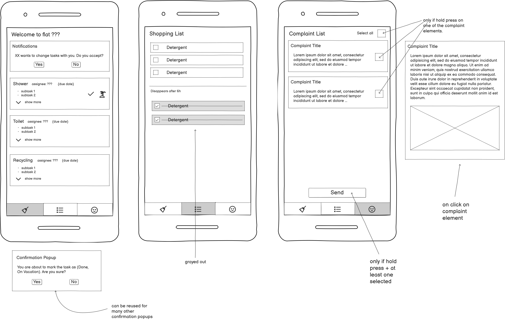

# FlatOrg 

- [FlatOrg](#flatorg)
  - [Tech Stack](#tech-stack)
    - [Roles \& Permissions](#roles--permissions)
  - [Coding \& Design Standards](#coding--design-standards)
  - [Functionality](#functionality)
    - [Core Function](#core-function)
    - [Switching Tasks](#switching-tasks)
    - [Vacation people (blue)](#vacation-people-blue)
    - [Notifications](#notifications)
  - [Further Functionality:](#further-functionality)
    - [Shopping list](#shopping-list)
    - [Complaint List](#complaint-list)
  - [UI/UX](#uiux)
  - [Implementation Details](#implementation-details)
    - [Task class](#task-class)
    - [Person class](#person-class)
    - [EthSemesterCalendar class](#ethsemestercalendar-class)
    - [Initial Assignment (TODO)](#initial-assignment-todo)
    - [Login](#login)
  - [Known Algorithm Tradeoffs](#known-algorithm-tradeoffs)
    - [Red L1 escape when Green L3 fills L2](#red-l1-escape-when-green-l3-fills-l2)
  - [Open Questions](#open-questions)


FlatOrg is a Flutter app for scheduling and managing household tasks in a co-living area. Built for a 9-person flat.

## Tech Stack

**Frontend: Flutter**
- Cross-platform (Android primary; iOS supported but push notifications use in-app panel only — no APNs key)
- UI reactivity via `StreamBuilder` + Firestore real-time streams
- Domain state machines use enums (no state management library needed)

**Backend: Firebase (Firestore + Cloud Functions)**
- Firestore for real-time database
- Cloud Functions (Blaze plan) for all scheduled/event triggers: week reset, push notifications, grace period transitions, shopping item cleanup
- Serverless — no dedicated server needed
- Blaze free tier is more than sufficient for 9 users

**Push Notifications: Firebase Cloud Messaging (FCM)**
- Android: native push via `firebase_messaging` package
- iOS: in-app notification panel only (no APNs key required)
- All notification triggers run as Cloud Functions

**Authentication: Firebase Auth with Email/Password**
- Admin invites members by adding their name + email to a whitelist in Firestore; members then register via the app using that email
- Email verification required on signup before app access is granted
- Password requirements: minimum 6 characters + at least one number (enforced client-side before submission to Firebase)
- Password reset: built-in Firebase reset-link flow, wired up in the UI
- Rate limiting on failed login attempts: handled automatically by Firebase Auth; app must display a clear, user-friendly error message when triggered

### Roles & Permissions

**Admin** (the flat creator; can transfer admin rights to another member):
- Add/remove members from the flat
- Modify tasks (name, description, due date, etc.)
- Read/write all tasks and app settings
- No read/write access to other members' personal data

**Normal Member** (includes admin):
- Mark themselves as on vacation
- Mark their own task as done
- Read/write on the shopping list
- Read/write/send on the complaints list

## Coding & Design Standards

- https://en.wikipedia.org/wiki/Design_Patterns This book is basically your bible. I want you to explore the page and the links inside, and then implement these principles in this project.

- do not use literal strings in code, store them in a seperate file and reference the variables in the file.
- when using themes, try to have a centralized way of controlling it. Refer to the youtube of designing good UI (TODO myself.)
  - E.g. 3 types of font sizes that is centralized in a file to be accessed. Or 3 main colorways that are also accessed that way. 
- Use "speaking" (i.e. self explanatory) names (variables, classes, and methods).
- Use constants (static final variables) instead of "Magic numbers". 
- Use docstrings to explain mehthods/fields when it is not obvious from their naming.
- Use comments to explain why something was coded in a certain way, not to explain how something was coded, or what the code does. 
- use tests for backend and frontend.


## Functionality

### Core Function

We assume there are 9 tasks and 9 people. The Tasks are grouped and also have a sequential ordering.

Toilet-> Kitchen -> Recycling -> Shower -> Floor(A) -> Washing rags -> Bathroom -> Floor(B) -> Shopping

Our tasks are divided into three difficulties, hard (3), medium(2) and easy(1). Each of the groups have one task inside.

- Level 3: Toilet, Shower, Bathroom
- Level 2: Floor(A), Floor(B), Kitchen
- Level 1: Recycling, Washing Rags, Shopping & report to @Livit

We want to reward those that do a task by assigning them a task of lower difficulty and those who don't with a task of higher difficulty. We call those who did their task Green Person, and those who didnt Red Person. (If they are on vacation, they are a Blue Person — handled separately.)

`reset_for_new_week()` runs the following steps in order:

1. **Blue short vacation** (`weeks_not_cleaned ≤ X`, admin-configurable, default 1 week) — assigned to tasks starting from L1, filling upward if there are more short-vacation people than L1 slots (L1 → L2 → L3). Among vacation people, those who had harder tasks get the harder available slots. Their slots are protected — Green people jump over them.
2. **Green L3** — move down to an L2 task. Scan forward from their current position in the task ring to find the next unassigned L2 task. If already taken by a Blue/Green person, continue scanning forward. If no L2 slots are free, stay at L3 (no reward, no punishment).
3. **Green L2** — move down to an L1 task. Scan forward from their current position in the task ring to find the next unassigned L1 task. If already taken, continue scanning forward. If no L1 slots are free, stay at L2 (no reward, no punishment).
4. **Red L3** — stay at L3. Take their same task if unassigned, otherwise take another unassigned L3 task.
5. **Red L2** — move up to L3. Take any unassigned L3 task. If all L3 slots are full, stay at their current L2 task next week.
6. **Red L1** — move up to L2. Take any unassigned L2 task. If all L2 slots are full, stay at their current L1 task next week.
7. **Green L1** — fill whatever slots remain (assigned last to avoid competing with Red people for harder slots).
8. **Blue long vacation** (`weeks_not_cleaned > X`) — fill whatever slots remain after Green L1. Their slots are not protected and do not block Green people from moving down.

**Why Green L3/L2 before Reds:** guarantees that people who did their task get a lighter task next week. Green L3 targets L2 and Green L2 targets L1 — these never compete with Reds who target L3. Only Green L1 ("anywhere") could interfere, so they are moved to the end.

### Switching Tasks

People can switch tasks 3 times per semester (3 tokens).

They can switch to a vacation person's slot without asking (the requester's original slot becomes the new vacation slot, and the vacation person is reassigned there). They can also swap with a non-vacation person if that person agrees. The swap lasts one week only.

`reset_for_new_week()` always uses the person's **original** task (pre-swap) to determine their green/red status and next week's assignment. The swap has no lasting effect on the rotation schedule.

### Vacation people (blue)

People can mark themselves as being on vacation before `reset_for_new_week()` runs. If they mark vacation after the week has already started, it takes effect the following week — no mid-week recompute.

Vacation status is tracked via the task's `weeks_not_cleaned` counter (see Task class), which increments each week the task goes uncleaned — whether the assignee is on vacation or the task is vacant.

- **Short vacation** (`weeks_not_cleaned ≤ X`, admin-configurable per flat, default 1 week): assigned in step 1 of the algorithm. Slots are protected — Green people skip over them.
- **Long vacation** (`weeks_not_cleaned > X`): assigned last (step 8), after Green L1. Their slots are not protected and Green people can take them, preventing long-term vacation from blocking the reward/punishment mechanism.

Overflow (more vacation people than L1 slots) fills L2, then L3, giving those with originally harder tasks the harder available slots.

A person is back from vacation when they complete their assigned task. `completed_task()` clears `on_vacation` and resets `vacation_weeks` to 0.

### Notifications

All notification triggers run as scheduled/event-driven Cloud Functions. Each task has its own due date/time — notifications are relative to that, not a fixed day of the week.

- **Reminder (1 day before):** sent to the assigned person 1 day before their task's due date/time. Always includes a prompt to either complete the task or mark themselves as on vacation.
- **Reminder (X hours before deadline):** sent X hours before the task's due date/time. X is configurable per flat by admin (default: 1h).
- **Task completed:** sent to everyone in the flat when any task is marked done.
- **Swap request:** when `request_change_task()` fires, the target person receives a push notification (Android) and the request appears in the in-app notification panel (all platforms).

## Further Functionality:

### Shopping list

A simple shared shopping list on a separate tab.

- Any member can add or remove any item (no ownership — person A can remove person B's item).
- Items are plain text.
- A member can mark an item as bought. Bought items move to a greyed-out secondary list at the bottom.
- Bought items are automatically deleted after X hours (configurable per flat by admin; default: 6h) via a Cloud Function.
- Duplicate items are acceptable — no deduplication needed.

### Complaint List

A list of complaints to be sent to Livit, on a separate tab.

- Any member can add a complaint (requires a title and a description).
- Any member can delete any complaint (no ownership).
- Members can select individual complaints or all at once, then tap a mail button which opens their email client pre-addressed to `studentvillage@ch.issworld.com`.
- Email boilerplate: the app randomly selects one of 3 pre-written German-language templates (to avoid repetitive emails to the landlord). Each template includes a polite greeting, a reference to the flat (HWB 33), and placeholder bullet points that are replaced with the selected complaints. The templates are:

  **Template 1:**
  > Sehr geehrte(r) Herr/Frau [Nachname des Vermieters oder der Verwaltung],
  > ich hoffe, Sie haben einen schönen Tag und eine gute Woche!
  > Wir melden uns bei Ihnen bezüglich unserer Wohnung HWB 33. Wir wohnen wirklich sehr gerne hier, haben aber in letzter Zeit ein paar Dinge bemerkt, die repariert oder einmal überprüft werden müssten.
  > Damit Sie einen guten Überblick haben, haben wir die aktuellen Punkte hier kurz für Sie aufgelistet:
  > * [Complaints inserted here]
  > Bitte lassen Sie uns wissen, wie wir am besten weiter vorgehen sollen und wann es für Sie oder einen Handwerker zeitlich passen würde, sich das einmal anzusehen.
  > Vielen Dank im Voraus für Ihre Mühe und Unterstützung!
  > Freundliche Grüsse
  > [Sender name] [Phone number]

  **Template 2:**
  > Guten Tag [Name des Vermieters],
  > ich hoffe, Sie haben eine tolle Woche!
  > Wir fühlen uns in der HWB 33 nach wie vor sehr wohl. Allerdings sind uns in letzter Zeit ein paar Kleinigkeiten aufgefallen, die nicht mehr ganz rund laufen und wahrscheinlich repariert werden müssten.
  > Hier ist eine kurze Übersicht für Sie:
  > * [Complaints inserted here]
  > Sagen Sie uns doch einfach Bescheid, wann es Ihnen oder einem Handwerker passen würde, kurz vorbeizuschauen. Wir richten uns da gerne nach Ihnen.
  > Vielen Dank schon einmal für Ihre Hilfe und einen wunderbaren Tag noch!
  > Liebe Grüsse
  > [Sender name] [Phone number]

  **Template 3:** *(TODO: third template to be provided)*
- Only the member currently assigned to the **Shopping** task (which includes "& report to @Livit") can trigger the send.
- To avoid spamming: the send button is enabled once per week per flat, and resets after Sunday 23:59. Once anyone sends, the button is disabled for all members until the reset.

## UI/UX



## Implementation Details

Architecture: state machines with events & handlers. UI listens to Firestore streams via `StreamBuilder` and rebuilds reactively.

### Task class

Each task is a state machine stored as a Firestore document.

**Attributes:**
- `name` — task name
- `description` — list of strings, each representing a subtask or step the assignee should complete
- `due_date_time` — configurable per task by admin
- `assigned_to` — person assigned (user ID)
- `original_assigned_to` — person assigned before any swap (used by `reset_for_new_week()`)
- `state` — enum: `pending | completed | not_done | vacant`
- `weeks_not_cleaned` — int, increments in `reset_for_new_week()` whenever the task's assignee is on vacation or the task is vacant; resets to 0 when the task is completed normally. Determines short vs. long vacation treatment (same threshold X as `vacation_weeks` was).

**State transitions:**

- **Pending (Yellow):** initial state set by `reset_for_new_week()`. Task not yet done.
  - Own deadline passes → transitions to `not_done` (Red)
  - Person marks done → transitions to `completed` (Green)
- **Completed (Green):** task was done before deadline.
  - Own deadline passes → stays `completed`
  - `reset_for_new_week()` fires → reassigned, returns to `pending`
- **Not Done (Red):** deadline passed without completion. Person is in grace period.
  - Holds until `reset_for_new_week()` fires (X hours after the **last** due date across all tasks this week)
  - `reset_for_new_week()` fires → person is treated as Red for next assignment, task returns to `pending`
- **Vacant:** assigned person was removed by admin mid-week. `assigned_to` is null.
  - Treated identically to a vacation task in `reset_for_new_week()`: if `weeks_not_cleaned ≤ X` → assigned in step 1 (protected slot); if `weeks_not_cleaned > X` → assigned in step 8 (unprotected).

**Week reset trigger:** A Cloud Function fires X hours (admin-configurable grace period; default 1h) after the latest due date of any task in the current week. At that point `reset_for_new_week()` runs for all tasks.

**Methods:**

`enter_grace_period()` — triggered by Cloud Function when a task's own deadline passes. Transitions `pending → not_done`. UI updates color from yellow to red.

`reset_for_new_week()` — Cloud Function. Reads each person's `original_assigned_to` task and state, runs the full assignment algorithm (blue → green → red order), writes new `assigned_to` and resets all states to `pending`.
- **Within each step, people are processed in sequential task-ring order** (by their current position in the sequence: Toilet → Kitchen → ... → Shopping). This determines who gets first pick when slots are scarce.
- **`original_assigned_to` is never updated while a person is on vacation.** It only updates at the end of a normal (non-vacation) week, so returning vacation people re-enter the rotation at their correct difficulty level.
- **Increments `weeks_not_cleaned`** on every task whose assignee is `on_vacation` or whose state is `vacant`, before running the assignment steps.
- **Must run as an atomic Firestore transaction** to prevent partial state (e.g. two people assigned to the same task) in the event of a crash or concurrent execution.

`completed_task()` — marks state as `completed` and resets `weeks_not_cleaned` to 0 on the task. Also clears the `on_vacation` flag on the assigned person. Updates `original_assigned_to` to this task only if the person is not on vacation.

`request_change_task()` — fires an event to the target person requesting a task swap. Target person sees a pending request in the notification panel and can accept or decline. On accept: swap `assigned_to` on both tasks (original assignments unchanged). On decline: request is cancelled and shown as declined in the requester's notification tile. Each accepted swap costs one token from the requester's balance.

 

### Person class

Each person maps to a Firebase Auth user and a Firestore document.

**Attributes:**
- `uid` — Firebase Auth user ID (primary key)
- `name` — display name
- `email` — used for login and invitations
- `role` — enum: `admin | member`
- `on_vacation` — bool
- `swap_tokens_remaining` — int (resets to 3 at the start of each ETH semester, computed by `EthSemesterCalendar`)

**Identity & permissions** are handled entirely by Firebase Auth + Firestore Security Rules. The app reads the person's `role` field to determine what UI elements and actions are available. No custom auth logic needed.

**Methods:**

`set_vacation(bool)` — sets `on_vacation`. Takes effect on the next `reset_for_new_week()` if set before it fires; otherwise takes effect the week after.

### EthSemesterCalendar class

A pure utility class (no Firebase dependency) that encapsulates ETH semester boundary computation. Used by the token-reset Cloud Function cron and anywhere else semester dates are needed.

**ETH semester schedule:**
- **Autumn Semester (HS):** calendar weeks 38–51 (14 weeks, mid-September to just before Christmas)
- **Spring Semester (FS):** calendar weeks 8–22 (15 weeks, mid-February to late May; includes one Easter week off)

**Methods:**
- `currentSemesterStart(DateTime date)` → returns the start date of the semester containing `date`
- `nextSemesterStart(DateTime date)` → returns the start date of the following semester
- `isInSemester(DateTime date)` → bool, whether the given date falls within an active semester

The token-reset Cloud Function is scheduled as a cron at the start of each semester using `nextSemesterStart()`.

### Initial Assignment (TODO)

**TODO:** design and implement the initial assignment UI. On first launch, admin must manually assign all 9 people to all 9 tasks before `reset_for_new_week()` can run. This is a one-time setup screen.

### Flat document (Firestore schema)

Each flat is a single Firestore document containing both identity and admin-configurable settings.

```
Collection: flats
  └── Document: {flatId}
        ├── name: String                          // flat display name
        ├── admin_uid: String                     // Firebase Auth UID of the admin
        ├── vacation_threshold_weeks: int          // short vs long vacation cutoff (default: 1)
        ├── grace_period_hours: int                // hours after last due date before reset runs (default: 1)
        ├── reminder_hours_before_deadline: int    // notification timing (default: 1)
        ├── shopping_cleanup_hours: int            // hours before bought items are deleted (default: 6)
        ├── complaint_send_enabled: bool           // resets to true every Sunday 23:59
        ├── last_complaint_sent_at: Timestamp?     // null if not yet sent this week
        └── created_at: Timestamp
```

All settings are editable by the admin only. Cloud Functions read these values at trigger time.

### Login

- Firebase Auth with Email/Password
- Admin adds members by name + email to a Firestore whitelist; members register via the app using their whitelisted email
- Email verification required before app access is granted
- Password: minimum 6 characters + at least one number, validated client-side
- Password reset: Firebase built-in reset-link email, triggered from the login screen
- Failed login rate limiting: automatic via Firebase Auth; app surfaces a clear error ("Too many attempts, try again later")
- See Roles & Permissions above for what each role can do

---

## Known Algorithm Tradeoffs

### Red L1 escape when Green L3 fills L2

When all 3 L3 people are Green, they move to L2 in step 2 and fill all 3 L2 slots. Red L1 people in step 6 then find no free L2 slots and stay at L1 — escaping punishment for that week.

This is an accepted tradeoff of the priority ordering: Green rewards take precedence over Red punishments. In practice this only occurs when all L3 people do their tasks in the same week that all L1 people fail theirs, which is unlikely. And Red L1 people staying at L1 (the easiest level) is a mild consequence regardless.

---

## Open Questions

**16. UI/UX Conflicts** does UI/UX correspond to the implementation? Or does it have things either missing, or more things, or has conflicts with the docs?

**17. Startup** How is the Flat inititialized? What fields and information does it need? How does the UI look like?